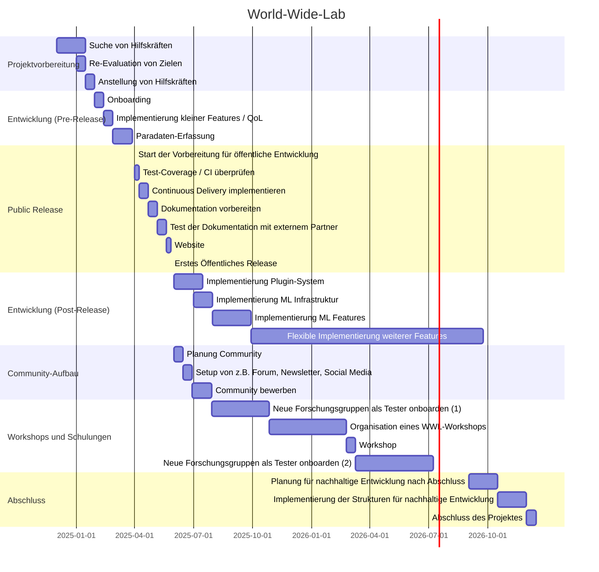

## Titel: Creating the Next Generation Data Sourcing Platform

### Kernaussage
> Bitte fassen Sie Ihre Projektidee auf max. 500 Zeichen zusammen. Der Leser sollte verstehen, worum es geht und warum Ihre Idee ausgewählt werden sollte!

Machine Learning und AI sind aktuell im globalen Fokus wie sie es nie zuvor waren. Den meisten ML Systemen liegen dabei manuell annotierte Daten zugrunde, wie z.B. bei Reinforcement Learning from Human Feedback (RLHF), womit Modelle wie ChatGPT erst praktisch nutzbar  werden. Ziel dieses Projektes ist die Entwicklung einer Plattform, die es möglich macht qualitativ hochwertige Daten günstig, global und zuverlässig zu sammeln.

### Zielsetzung, Forschungsfragen und Neuartigkeit des Vorhabens
> Bitte beschreiben Sie, was das Ziel Ihres Projekts ist, welchen Forschungsfragen Sie nachgehen möchten und was die Projektidee von vorhandener Forschung, Entwicklung und Produkten unterscheidet (max. 4000 Zeichen)!

Während der Forschung zu Fairness in Machine Learning (ML) und Artificial Intelligence (AI) im Rahmen meiner Dissertation ist mir aufgefallen, wie sehr das Feld aktuell von wenigen Datensätzen dominiert wird. Diese Datensätze fallen fast ausschließlich unter das sogenannte "WEIRD" Akronym, da sie aus Western, Educated, Industrialized, Rich und Democratic Ländern stammen oder diese abbilden.

Der Mangel an Diversität von Daten in ML beeinflusst neben Forschungsergebnissen direkt, auch alle Modelle die darauf basieren. Dies ist vor allem bei Foundation Models, also Modellen welche als Basis für die Entwicklung weiterer Modelle dienen, ein besonderes Problem. Ähnliche Probleme werden in ML und AI generell immer wieder aufgebracht, jedoch bis heute kaum adressiert.

Die Entwicklung von Large Language und Multimodal Models wie ChatGPT, bringt dabei noch ein weiteres Problem mit sich: Bereits heute sind ein großer Teil der Daten von bezahlten Daten-Sammlungs-Websites wie Amazon Mechanical Turk von AI Modellen generiert. Eine Studie von 2023 schätzte den Anteil der AI generierten Antworten auf eine Texteingabe auf 33 - 46%.  Dieser Anteil wird in Zukunft nur noch weiter steigen, da es immer schwieriger wird AI-generierte Inhalte zuverlässig zu erkennen und immer leichter sie zu generieren. Auch wenn diese Modelle beim Labelling von Daten hilfreich sein können, werden sie es doch niemals komplett ersetzen können, da ihre Qualität immer anhand manuell erfasster Daten evaluiert werden muss.

Ziel dieses Projektes ist die Entwicklung einer neuen Software zur zeitgemäßen Erhebung von Daten: World-Wide-Lab. Anders als existierende Lösungen ist diese so entworfen, dass sowohl typische Probleme, als auch neuere Entwicklungen in der Online-Datenerhebung von vorneherein mit einbezogen werden. Beim Design der Platform baue ich dabei auf gesammelte Erfahrungen von der Skalierung einer online Citizen Science / Crowdsourcing Website welche ich von der Inbetriebnahme vor ein paar Jahren, zu mehr als 5 Millionen Teilnehmern heute technisch unterstützt habe. Die Platform wird so konstruiert, dass sie frei skalierbar ist und so gleichzeitig günstig betrieben werden kann, aber auch schnell und automatisch Ressourcen hoch skalieren kann falls eine Datenerhebung spontan über Social Media "viral" wird. Darüber hinaus planen wir die automatische Erfassung und Auswertung von Paradaten (z.B. Mouse-Tracking, Tipp-Geschwindigkeit, Klick-Verhalten, etc.) um Probleme in der Datenqualität wie AI generierte Antworten erkennen und adressieren zu können. Gleichzeitig planen wir Machine Learning in der Plattform effizient zu nutzen um bei Bedarf automatisch die hilfreichsten Datenpunkte zum Labelling auszuwählen (Active Learning) oder auch Labels selbst zu generieren und z.B. nur alle Labels bei denen ein Algorithmus unsicher ist manuell annotieren zu lassen. Die Plattform selbst ist dabei flexibel genug um variable Nutzerschnittstellen zur Datensammlung zu unterstützen, wie z.B. eine spezialisierte Schnittstelle zur Annotierung von Pupillen in Augen, welche ich vor ein paar Jahren entwickelt habe. Außerdem ermöglicht diese Flexibilität auch optimiertes Design für eine Gamification der Datengewinnung, womit sowohl die Kosten wie auch das Risiko AI generierter Daten reduziert werden kann. Ziel des Projektes ist es diese und weitere Anforderungen zusammen mit  Industrie- und Forschungspartnern zu sammeln, zu priorisieren und in der Software umzusetzen.

Aktuell gibt es einen ersten, deutlich vereinfachten Prototyp der Plattform, welcher bereits erfolgreich mehr als 1.000 Sessions und etwa 75.000 Datenpunkte am Tag verarbeitet. Mit Hilfe des Software Campus wäre es möglich diesen Prototypen auszubauen um die oben genannten Features zu implementieren. Ein weiterführendes Ziel dieses Projektes wäre es eine (Open Source) Community um das Projekt herum zu entwickeln um eine langfristige Weiterentwicklung und Nutzung der Software zu gewährleisten.

### Einbindung in den Software Campus
> Bitte beschreiben Sie, wie die Einbindung in den Software Campus (Partnerschaft mit Industrie, Mentoring, Anleitung in Unternehmensführung, Förderung durch BMBF) in der Durchführung Ihres Projektes hilft (max. 1000 Zeichen)!

Der Software Campus wäre eine ideale Umgebung für World-Wide-Lab, da das Projekt aktuell sehr von der Forschung geprägt sind. Durch die Zusammenarbeit mit einem Industriepartner ist es möglich auch die Perspektive der Wirtschaft in das Projekt einfließen zu lassen. Das Projekt ließe sich dann so entwickeln, dass neben der Forschung auch die Industrie insgesamt und vor allem der Projektpartner maximal von dem Projekt profitieren können. Obwohl ich dieses Projekt als neues Projekt eingetragen habe, gibt es starke Beziehungen zu vorgeschlagenen Projekten, wie Projekt #18876 oder #19161.

Da es sich um ein Software-Projekt handelt, passt der Ablauf des Software Campus ideal dazu. Ich plane, die Infrastruktur rund um das Projekt so aufzubauen, dass mehrere Entwickler reibungslos daran arbeiten können und der Software Campus wäre ein guter Test hierfür. Ich wäre auch sehr interessiert in eine planendere Rolle zu treten und meine Tätigkeit von dem Schreiben hin zu Reviews von Code zu bewegen.

### Umsetzungsansatz / Methodik und erwartete Endergebnisse
> Bitte beschreiben Sie, wie die angestrebten Ziele erreicht werden sollen und welche Ergebnisse Sie erwarten (max. 2500 Zeichen)!

Auch wenn bereits eine klare Liste an Zielen und angestrebten Endergebnissen existiert, wird der erste Schritt des Projektes eine Aktualisierung und Neuevaluation dieser Ziele in enger Kollaboration mit dem Industriepartner sein. Der nächste Schritt wird die Anstellung mehrerer studentischer Hilfskräfte oder eventuell die Teilfinanzierung einer/eines neuen wissenschaftlichen Mitarbeiterin/Mitarbeiters im Lehrstuhl sein um an dem Projekt zu arbeiten.

Bei der Umsetzung der finalen Ziele richtet sich der geplante Ansatz an den Prinzipien der agilen Softwareentwicklung aus. Die Umsetzung würde dabei in Zwei-Wochen Sprints erfolgen, mit regelmäßiger Sprint-Planung. Im Zwei- bis Acht-Wochen Takt wird dabei die Koordination mit den Projektpartnern inkl. dem Industriepartner erfolgen um sowohl den Fortschritt als auch die Zielsetzung stets neu zu kalibrieren. Die Kollaboration an dem Projekt wird möglichst öffentlich über GitHub erfolgen, Code Reviews werden auf der "Pull Request"-Ebene erfolgen, Code Qualität wird über automatische Tests in einer CI-Pipeline sicher gestellt und eine CD-Pipeline wird für Deployments und Releases verantwortlich sein.

Neben dem Industriepartner ist auch die Kollaboration mit Forschungspartnern eins der Ziele des Projekts. Basierend auf einer existierende Liste an interessierten Forschungspartnern werden wir im Rahmen der Entwicklung regelmäßig in Kontakt mit einzelnen Forschungsgruppen treten um deren Bedürfnisse an die Software zu erfahren und miteinzubeziehen. Der Kontakt zu Partnern wird auch dazu dienen die Qualität der Dokumentation abzuschätzen und zu verbessern: Forschungspartner werden Zugang zur Dokumentation erhalten und erst bei Zwischenfragen wird das Team eingreifen und darauf folgend die Dokumentation verbessern. Darüber hinaus plane ich von dem ersten öffentlichen Release der Software an mehrere Workshops zu organisieren um interessierte Partner auf die Software aufmerksam zu machen und sie in diese einzuführen.

Das Endergebnis sollte hierbei eine Software-Lösung inkl. Dokumentation und Community sein, welche auch nach Ablauf des Software Campus Projektes weiterhin nachhaltig weiterentwickelt und aufrechterhalten werden kann.

## Motivationsschreiben
> Bitte beschreiben Sie Ihre Motivation für die Teilnahme am Software Campus. (Max 300 Worte / 2500 Zeichen)

An das Komitee des Software Campus,

Mit diesem Schreiben möchte ich mich gerne mit meinem Projekt für den Software Campus bewerben. Ich hatte im Winter durch ein aktuelles Mitglied vom Software Campus erfahren und war direkt sehr von der Idee angetan.

Die Teilnahme am Software Campus wäre eine hervorragende Möglichkeit, meine Fähigkeiten in den Bereichen Softwareentwicklung und Projektmanagement weiter zu vertiefen. Während meiner bisherigen Arbeit in Forschung und Wirtschaft, hatte ich die Gelegenheit, sowohl theoretische als auch praktische Kenntnisse in diesen Bereichen zu erwerben und ich bin überzeugt, dass der Software Campus mit seinem Fokus auf Leadership mir dabei noch viele weitere Möglichkeiten zu Wachstum eröffnen wird.

Zudem freue ich mich auf den Austausch mit anderen Teilnehmern, Mentoren und Partnern. Ich glaube fest daran, dass interdisziplinärer Austausch und Zusammenarbeit der Schlüssel zu Innovation und Fortschritt sind, vor allem zwischen Industrie und Forschung. Daher bin ich gespannt, von den Erfahrungen anderer zu lernen und meine eigenen Erfahrungen und Perspektiven einzubringen.

Das von mir vorgeschlagene Projekt, World-Wide-Lab, zielt darauf ab, ein wichtiges Problem in der ML-Forschung anzugehen: Die Schwierigkeit der Sammlung hochqualitativer Daten und den daraus resultierenden Mangel an Diversität in Datensätzen. Ich glaube, dass die Entwicklung dieses Projekts einen bedeutenden Beitrag zur Verbesserung der Datengrundlage für praktische ML- und AI-Modellen leisten kann. Die Teilnahme am Software Campus würde mir dabei die notwendigen Ressourcen und Unterstützung bieten, um dieses Projekt voranzutreiben.

Über eine Einladung zu den Auswahltagen würde ich mich sehr freuen und möchte mich für die Organisation dieser aufregenden Möglichkeit bedanken.

## Lebenslauf
> Lichtbild hinzufügen?!

https://github.com/posquit0/Awesome-CV/issues/270

## Gantt Char

